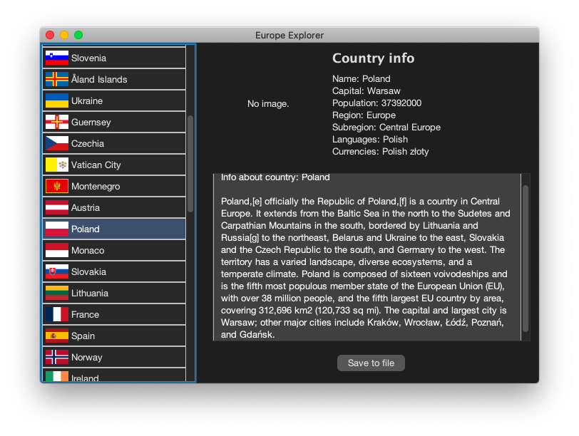

# Europe Explorer

A modern Java Swing desktop application designed to explore detailed information about European countries. The application combines real-time data fetching from REST APIs with web scraping techniques to provide a rich, interactive user experience.

## Project Overview

**Europe Explorer** acts as a dynamic encyclopedia. Instead of relying on a static database, it fetches the latest statistics (population, currencies, languages) from the **REST Countries API** and enriches this data by scraping images and descriptions directly from **Wikipedia**.

### Key Features

* **Real-Time Data**: Fetches up-to-date country data from `https://restcountries.com`.
* **Web Scraping Integration**: Uses **Jsoup** to scrape Wikipedia for country flags/images and introductory paragraphs, handling modern web security (User-Agent headers).
* **Smart Caching**: Implements a persistent JSON-based cache (`wiki_cache.json`) to store scraped descriptions, reducing network traffic and speeding up subsequent lookups.
* **Asynchronous UI**: Utilizes `SwingWorker` for all network operations (API calls, image downloading), ensuring the interface remains responsive (non-blocking).
* **Modern Dark UI**: Features a sleek, dark-themed interface powered by **FlatLaf** (Flat Look and Feel).
* **Data Export**: Allows users to save specific country details to a local text file.

## Technical Architecture

The project follows a layered architecture to separate concerns:

* **GUI Layer (`com.ProjectCountries.gui`)**:
    * `ExplorerWindow`: Manages the Swing components, event listeners, and background workers.
    * Uses **FlatMacDarkLaf** for consistent rendering across platforms.
* **Model Layer (`com.ProjectCountries.model`)**:
    * `Country`: Data record representing a nation.
    * `CountryService`: Handles HTTP connections to the REST Countries API and parses JSON responses using `org.json`.
* **Service Layer (`com.ProjectCountries.service`)**:
    * `WikiService`: Handles web scraping logic. Checks the local cache first; if data is missing, it scrapes Wikipedia and updates the cache file.

## Tech Stack

* **Language**: Java 17+
* **Build Tool**: Maven
* **GUI Framework**: Java Swing
* **Libraries**:
    * `FlatLaf` (UI Theme)
    * `Jsoup` (HTML Parsing & Scraping)
    * `Jackson` (JSON Serialization for Cache)
    * `org.json` (API Response Parsing)
    * `Log4j2` (Logging)

## Setup and Execution

### Prerequisites
* Java Development Kit (JDK) 17 or higher.
* Maven installed (or use IDE wrapper).

### Installation
1.  **Clone the repository**:
    ```bash
    git clone [https://github.com/BeneNat/europe-explorer-java.git](https://github.com/BeneNat/europe-explorer-java.git)
    cd europe-explorer-java
    ```

2.  **Build the project**:
    ```bash
    mvn clean install
    ```

3.  **Run the application**:
    You can run the `Main` class from your IDE or use the generated JAR (if configured):
    ```bash
    # Via Maven
    mvn exec:java -Dexec.mainClass="com.ProjectCountries.Main"
    ```

## Application Screenshot



> *The interface showing the list of countries on the left and scraped details (flag + description) on the right.*

## Author and Context

**Author:** Filip Żurek
**Institution:** AGH University of Krakow
**Faculty:** Faculty of Computer Science, Electronics and Telecommunications
**Field of Study:** Electronics and Telecommunications
**Course:** Introduction to Java Programming

## License

This software is distributed under the MIT License. Refer to the [LICENSE](LICENSE) file for the full text.

---
*AGH University of Krakow - Introduction to Java Programming Project 2025*